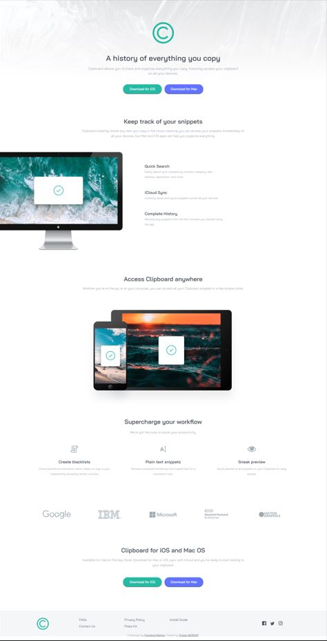

# Frontend Mentor - Clipboard landing page solution

This is a solution to the [Clipboard landing page challenge on Frontend Mentor](https://www.frontendmentor.io/challenges/clipboard-landing-page-5cc9bccd6c4c91111378ecb9). Frontend Mentor challenges help you improve your coding skills by building realistic projects. 

## Table of contents

- [Overview](#overview)
  - [The challenge](#the-challenge)
  - [Screenshot](#screenshot)
  - [Links](#links)
- [Author](#author)

## Overview

### The challenge

### The challenge

The challenge is to build a landing page and get it look as close to the design as possible.(Reference image are in ./design)

The users should be able to :
- View the optimal layout for the site depending on their device's screen size
- See hover states for all interactive elements on the page

### Screenshot

### Screenshot

Screenshots of the current result.

#### Desktop

#### Mobile

### Links

- [Live site URL here](https://tristanberger6.github.io/FM_clipboard_landing_page/)

## Author

- Frontend Mentor - [@TristanBerger6](https://www.frontendmentor.io/profile/TristanBerger6)
